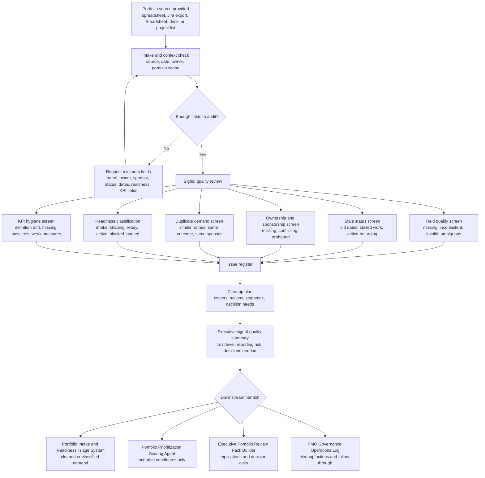

# Portfolio Signal Quality Auditor

**Portfolio Signal Quality Auditor** is a public-safe ChatGPT Project package for auditing whether portfolio inventory data is reliable enough to support intake, prioritization, executive review, and governance decisions.

## Operating problem

Portfolio reports become unreliable when status fields are inconsistent, ownership is missing, target dates are stale, stalled work appears active, duplicate demand accumulates, readiness is unclear, and KPI definitions drift. Leaders need a signal-quality audit before trusting portfolio views.

This package helps a PMO, portfolio leader, program governance lead, transformation office, or executive operator inspect the quality of portfolio signals before using them for decisions.

## Who it is for

- PMO, EPMO, PPMO, and portfolio governance leaders
- Program and transformation leaders cleaning up portfolio inventory
- Executive operations teams preparing decision-ready portfolio views
- Portfolio analysts reviewing Jira, Smartsheet, spreadsheet, or governance-deck extracts
- Leaders who need cleaner intake, prioritization, and executive review inputs

## What it does

- Reviews portfolio records for field-quality issues, missing values, inconsistent taxonomy, stale dates, and ambiguous status
- Flags stale or stalled work that may be incorrectly shown as active
- Identifies missing owners, sponsors, accountable leads, and decision rights
- Finds duplicate-demand candidates without automatically merging records
- Classifies readiness using transparent rules
- Reviews KPI hygiene, including unclear definitions, missing baselines, and weak measures
- Produces a signal-quality audit, issue register, cleanup plan, and executive summary
- Routes outputs into adjacent PMO and portfolio governance modules

## What it does not do

- It does not change source records, re-platform tools, or act as a system of record.
- It does not approve status changes, funding decisions, prioritization, sequencing, or remediation.
- It does not replace Jira, Smartsheet, a PPM tool, PMO governance, finance, audit, compliance, or executive judgment.
- It does not certify official KPI, financial, risk, compliance, or delivery outcomes.

## Module boundary

**This module starts when** a portfolio inventory, spreadsheet, Jira export, Smartsheet table, governance deck, or project list needs signal-quality review.

**This module ends when** the user has a signal-quality audit, issue register, cleanup plan, executive summary, and downstream handoff guidance.

**This module produces** field-quality findings, stale-status flags, missing owner and sponsor lists, duplicate-demand candidates, readiness classifications, KPI hygiene concerns, reporting-risk summary, cleanup plan, and handoff packet.

**This module hands off to** Portfolio Intake and Readiness Triage System, Portfolio Prioritization Scoring Agent, Executive Portfolio Review Pack Builder, and PMO Governance Operations Log.

**This module does not** re-platform tools, change records, approve status changes, merge demand, calculate official KPI results, or become the portfolio system of record.

## Architecture decision

| Decision area | Design choice |
|---|---|
| Operating problem | Portfolio data often looks governable before it is trustworthy. This module audits signal quality before leaders rely on portfolio views. |
| Existing adjacent modules | Business Case System shapes investment logic; Project Charter Initiation Agent converts approved intent into charters; Portfolio Prioritization Scoring Agent scores decision-ready demand; PMO Governance Operations Log manages follow-through; Executive Portfolio Review Pack Builder prepares executive discussion. |
| What's missing | A pre-governance hygiene layer that tests whether portfolio records are complete, current, owned, non-duplicative, readiness-classified, and KPI-coherent. |
| Lifecycle position | After raw portfolio capture; before intake triage, prioritization, sequencing, and executive portfolio review. |
| This module owns | Signal-quality assessment, reporting-risk summary, issue register, cleanup plan, and handoff recommendations. |
| Adjacent modules own | Intake decisions, scoring, sequencing, executive tradeoffs, business cases, charters, operating follow-through, and official status changes. |
| Accepted inputs | CSV-style tables, pasted portfolio rows, Jira exports, Smartsheet tables, project lists, governance decks, manually summarized portfolio records. |
| Produced outputs | Audit summary, issue register, stale-status flags, owner/sponsor gaps, duplicate candidates, readiness classification, KPI hygiene concerns, cleanup plan. |
| Downstream handoffs | Cleaned or classified demand to intake and scoring; implications to executive review; actions to operations log. |
| Human-owned decisions | Status changes, record merges, priority calls, owner assignments, sponsor confirmation, KPI definitions, executive decisions, funding, sequencing. |
| Non-overlap boundary | The auditor checks whether portfolio signals are usable. It does not score, approve, sequence, charter, fund, or operate the work. |

## Installation and usage

### Use inside ChatGPT

1. Download or clone this repository.
2. Open the repository folder.
3. Upload **only** the `chatgpt-project/` folder into a new ChatGPT Project.
4. Use the contents of `AGENTS.md` as the Project instruction layer if your ChatGPT workspace supports project instructions.
5. Start with `chatgpt-project/start-here.md`.
6. Paste or upload a portfolio inventory extract, spreadsheet rows, Jira export summary, Smartsheet table, or governance-deck project list.
7. Ask for a signal-quality audit, issue register, cleanup plan, executive summary, or downstream handoff packet.

Do **not** upload the full repository into ChatGPT unless you are using it for reference. The runtime is intentionally limited to `chatgpt-project/`.

### Use with Codex or local tooling

Use the full repository when working locally, publishing to GitHub, or extending the package. The full repo includes examples, workflow source, quality-review evidence, and public documentation.

Suggested local workflow:

```bash
git clone <your-repo-url>
cd portfolio-signal-quality-auditor
```

Then inspect:

```bash
cat README.md
ls chatgpt-project
open examples/sample-output.html
```

No build step, dependency installation, API key, or configuration file is required.

## Runtime file count and constraints

- Runtime folder: `chatgpt-project/`
- Runtime structure: flat only; no nested folders
- Runtime file count: 15 files
- Runtime cap: 25 files or fewer
- Configuration: none required
- Public-safety model: synthetic examples only; no private employer, client, financial, security, legal, personnel, or proprietary data

## Primary outputs

1. Portfolio signal-quality audit
2. Issue register
3. Stale-status and stalled-work flags
4. Missing ownership and sponsorship findings
5. Duplicate-demand candidate list
6. Readiness classification view
7. KPI hygiene findings
8. Reporting-risk summary
9. Cleanup plan
10. Downstream handoff packet

## Adjacent module fit

| Adjacent module | Relationship |
|---|---|
| Portfolio Intake and Readiness Triage System | Receives cleaned or classified demand requiring intake routing. |
| Portfolio Prioritization Scoring Agent | Receives records that are clean enough to score. |
| Executive Portfolio Review Pack Builder | Receives reporting-risk implications and decision asks. |
| PMO Governance Operations Log | Receives cleanup actions, owners, follow-up dates, and unresolved decisions. |
| Business Case System | May send early demand records whose business logic is not yet clean enough for review. |
| Project Charter Initiation Agent | May send chartered work that has unclear status, ownership, or reporting fields. |
| AI Artifact Lifecycle Governance System | May send AI artifact inventories with reliance or ownership ambiguity. |

## Lifecycle position

| Portfolio lifecycle stage | Module role |
|---|---|
| Raw demand / inventory capture | Accepts messy source records for audit. |
| Signal-quality review | Owns quality checks, issue discovery, and reporting-risk assessment. |
| Intake readiness | Hands classified demand to intake triage. |
| Prioritization | Hands scorable records to portfolio scoring. |
| Executive review | Hands implications and decision needs to executive review pack builder. |
| Governance follow-through | Hands cleanup actions to the operations log. |

## Workflow



## Folder structure

```text
portfolio-signal-quality-auditor/
├── README.md
├── AGENTS.md
├── LICENSE.md
├── .gitignore
├── chatgpt-project/
│   ├── start-here.md
│   ├── operating-model.md
│   ├── trigger-map.md
│   ├── portfolio-data-intake.md
│   ├── signal-quality-rules.md
│   ├── stale-status-screen.md
│   ├── ownership-sponsorship-screen.md
│   ├── readiness-classification-rules.md
│   ├── duplicate-demand-screen.md
│   ├── kpi-hygiene-screen.md
│   ├── cleanup-plan-template.md
│   ├── handoff-rules.md
│   ├── working-session-prompts.md
│   ├── quality-review-rubric.md
│   └── privacy-human-control.md
├── examples/
│   ├── sample-data.html
│   ├── sample-prompts.html
│   └── sample-output.html
├── workflow/
│   └── workflow.mmd
└── quality-review/
    ├── package-test-results.html
    └── framework-output-test.html
```

## Example locations

- `examples/sample-data.html` contains synthetic dummy portfolio data.
- `examples/sample-prompts.html` contains prompts for running the audit inside ChatGPT.
- `examples/sample-output.html` contains a sample signal-quality audit based on the dummy data.
- `quality-review/framework-output-test.html` contains the functional output test using the framework against the synthetic 120-row scenario.
- `quality-review/package-test-results.html` contains packaging checks plus a reference to the functional output test.

## Human-control statement

This module supports intake, classification, review, synthesis, routing, drafting, and quality review. Human owners remain accountable for status changes, sponsor confirmation, prioritization, funding, sequencing, KPI definitions, record cleanup, compliance decisions, executive decisions, and changes to live systems.

## License

Source code and scripts are licensed under MIT. Documentation, prompts, templates, examples, and other non-code materials are licensed under CC BY 4.0 with attribution to Marco Policani. See `LICENSE.md`.

## Search keywords

portfolio signal quality auditor, portfolio hygiene audit, PMO data quality, portfolio governance, project portfolio management, portfolio reporting risk, stale status review, duplicate demand review, portfolio readiness classification, KPI hygiene, executive portfolio review, PMO cleanup plan, AI-assisted PMO, ChatGPT Project PMO toolkit, portfolio inventory audit, governance signal review.
